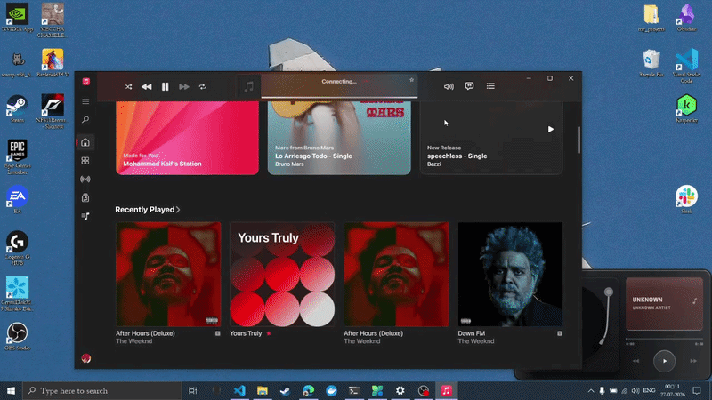

# vinyl

A little turntable that sits on your desktop and plays along with whatever you're listening to.

The idea was my little sister's. I just brought it to life.

Put something on (Spotify, Apple Music, a YouTube tab, honestly anything) and the record starts spinning. The tonearm drifts inwards as the song goes on, the way a real one does. The album art becomes the label in the middle, and the little screen takes its colour from the cover, so a red album turns the screen red. If the song has lyrics, they scroll past in time with it.

That's the whole thing, really.

It's not trying to replace your music player. You can't browse anything, there's no library, no playlists. It just sits there and spins.



## Getting it

Grab the installer from [Releases](../../releases) and run it. Windows 10 or 11.

Windows will show you a **"Windows protected your PC"** box the first time. That's expected, see below.

## Is it safe?

Reasonable question. It's an unsigned .exe from a stranger on the internet, and you should want an answer before running it.

**That Windows warning.** The installer isn't code-signed. Signing certificates run a few hundred a year, which is a lot for a turntable I made for my sister. The message means Windows doesn't recognise who made it, not that it found anything wrong with it. Click **More info** then **Run anyway**, or skip it entirely and build from source, instructions are further down.

**What leaves your computer.** One thing, and only if lyrics are switched on: the song title and artist go to lrclib.net so it can look up the words. That's the only address this app ever contacts, and you don't have to take my word for it, it appears exactly once in the whole codebase, in [`src-tauri/src/lyrics.rs`](src-tauri/src/lyrics.rs). Untick **Show lyrics** and it makes no internet requests at all, ever.

**What doesn't.** Everything else. It reads what's playing from Windows' own media session, the same thing that powers the popup when you hit the volume keys. Album art is kept in memory and never written to disk. No telemetry, no analytics, no accounts, no update pings, nothing phoning home.

**What it writes.** Two files, both local:

- `%APPDATA%\dev.lordaizen.vinyl\config.json`, your settings
- `%LOCALAPPDATA%\vinyl\vinyl.log`, for when something breaks

Worth knowing the log notes down each song it looked up, so it is a small record of what you played. It's wiped every time the app starts, and you can delete it whenever you like.

## Using it

It lives on your desktop, underneath your other windows. Open something and it disappears behind it; go back to your desktop and there it is again.

Out of the box it's **locked**, which means it ignores the mouse completely. Clicking straight through it hits the desktop, same as clicking the wallpaper. It just sits there and spins.

To move it, untick **Lock in place** in the tray menu. Then:

- **Drag it** from anywhere on its body. It won't let you shove it off the edge of the screen or under the taskbar.
- **Right-click it** for the menu.
- The play and skip buttons work too.

Lock it again when you've put it where you want it.

- **Left-click the tray icon** to hide or show it.

The tray icon is your way in whenever it's locked, since a locked widget can't be right-clicked.

In the menu you'll find:

| | |
|---|---|
| **Show vinyl** | Hides it without quitting. Left-clicking the tray icon does the same. |
| **Lock in place** | On by default. Untick it to move the widget or use its buttons. |
| **Full size / Compact** | Compact is just the deck, nothing else. Nice if you want it out of the way. |
| **Appearance** | Light, dark, or follow whatever Windows is doing. |
| **Show lyrics** | On by default. See the note below. |
| **Quit vinyl** | Does what it says. |

## Little things you might not spot

**No album art?** It presses one instead. You get an iridescent mother-of-pearl label with the artist's initial on it and a made-up catalogue number, and the same song always gets the same label. Lots of things have no artwork, browser tabs especially, and a blank circle looked broken rather than minimal.

**In compact mode, click the deck** to play or pause. There are no buttons at that size, so the record itself is the button. (You'll need to unlock it first.)

**It remembers where you put it**, and comes back there next time you start it.

**Livestreams** say `LIVE` instead of pretending to have a position, because they don't have one.

**Watching a video rather than listening to music?** It shows the title and leaves it at that. No lyrics, since the name of a film isn't a song.

**If you've turned down animations in Windows**, the tonearm stops swinging about and just moves. The record still turns, since that's rather the point.

## The lyrics thing

Windows tells the app what's playing, but it has no idea about lyrics, nobody does. So when a song starts, it asks [LRCLIB](https://lrclib.net), a free community-run lyrics database, whether it knows that one.

Which is the one time the app talks to the internet, as above.

Fair warning, it doesn't always find them. Apps like Spotify and Apple Music report nice clean song names so those usually work. YouTube reports the whole video title, `Some Artist - Song Name (Official Video) [4K]`, which is a bit more of a guessing game. It tries its best.

## Building it yourself

You'll want [Rust](https://rustup.rs) and [Node](https://nodejs.org).

```bash
npm install
npm run tauri dev     # run it
npm run tauri build   # make an installer
```

The installer lands in `src-tauri/target/release/bundle/`.

If you fancy poking at the look of it without waiting for Rust to compile every time, there's a browser harness:

```bash
python -m http.server 8731
# then open http://127.0.0.1:8731/design/app-preview.html
```

It runs the real interface against fake data. Add `?state=none`, `?size=compact`, `?theme=dark`, that sort of thing. The options are listed in a comment at the top of the file.

## If something breaks

There's a log at `%LOCALAPPDATA%\vinyl\vinyl.log`, wiped fresh each time it starts. It usually says something useful. Feel free to open an issue and paste it in.

Your settings live in `%APPDATA%\dev.lordaizen.vinyl\config.json`: window position, size, theme, whether lyrics are on. Delete it and everything goes back to defaults.

## Bits and pieces

Built with [Tauri](https://tauri.app), so it's a Rust backend with an HTML front end, and the whole thing is under 50 MB of memory. The turntable is hand-drawn SVG, no images. It reads Windows' own media session (SMTC), which is the same thing that powers the little popup when you press the volume keys, so it works with anything that talks to Windows properly.

Fonts and icons belong to other people and their licences are in [THIRD-PARTY-LICENSES.md](THIRD-PARTY-LICENSES.md).

MIT licensed. Do what you like with it.
